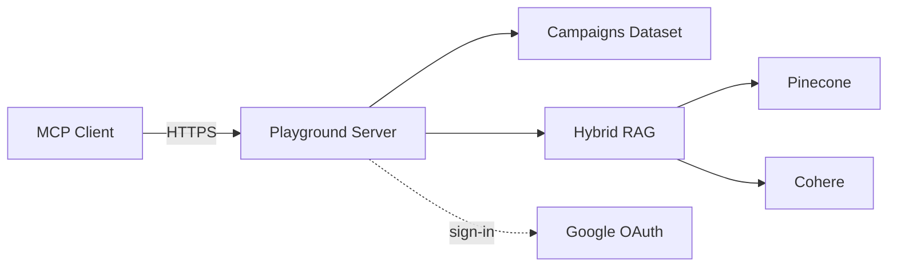

# MCP Playground

A public MCP server you can point your agent at in 30 seconds — the one behind
[mcpbuilders.dev](https://mcpbuilders.dev). It's a live demo of two things I
kept getting asked about: **per-user OAuth on an MCP server**, and a
**hybrid-RAG pipeline** you can actually query.

No sign-up. No API keys. Just add it and go.

## Quickstart

```bash
claude mcp add --transport http playground https://playground.mcpbuilders.dev/mcp
```

Then try:

- *"What are the top creatives by ROAS this month?"* — hits the campaigns dataset, no auth.
- *"Search the Sherlock Holmes stories for a scene with a bicycle."* — hits the RAG pipeline, no auth.
- *"Save that as a view called 'bike-scenes'."* — prompts you to sign in with Google, then saves it under your identity.

That last one is the point of the whole thing: some tools are public, some
are scoped to *your* Google identity, all on the same server.

## Why this exists

Most MCP examples show one of two things: an anonymous read-only server, or
a fully-locked-down one. Real products live in the middle — some tools you
want anyone to try, some tools have to know who's calling. This repo is a
worked example of that middle case, wired end-to-end with Google OAuth.

The RAG demo is here because "hybrid retrieval" gets talked about a lot but
rarely shown as a runnable thing. Point your agent at it and ask questions
of *The Adventures of Sherlock Holmes*, *A Study in Scarlet*, or
*The Hound of the Baskervilles* — a Pinecone-dense + BM25-sparse + Reciprocal
Rank Fusion + Cohere rerank pipeline over public-domain text.

Two demos, one server, both live.

## What's in it



| Tool | Auth | What it does |
|---|---|---|
| `top_creatives` | anonymous | Creatives ranked by ROAS over 7d/30d/90d |
| `spend_breakdown` | anonymous | Spend/revenue by channel, campaign, or creative type |
| `list_campaigns` | anonymous | All campaigns with creatives and 90d totals |
| `rag_query` | anonymous | Hybrid retrieval over the Gutenberg corpus |
| `list_documents` | anonymous | Corpus manifest — titles, authors, source URLs |
| `get_document` | anonymous | Full text of one book by id |
| `save_view` | **Google sign-in** | Save a named query view, scoped to your identity |
| `my_views` | **Google sign-in** | List only the caller's saved views |

The gated tools stay visible in `tools/list` even when you're anonymous — call
them without a token and you get sign-in instructions back, not a "tool not
found" error. It's a small thing but it's how discovery is supposed to feel.

Deeper architecture writeup is in [docs/architecture.md](docs/architecture.md).

## How auth works

<details>
<summary>The 30-second version</summary>

OAuth is handled entirely by FastMCP's stock
[`GoogleProvider`](https://gofastmcp.com/servers/auth/oauth-proxy) against a
Google OAuth web client. It's an OAuth proxy that implements the MCP
authorization spec — discovery, dynamic client registration, PKCE, the whole
callback dance. No custom auth server code lives in this repo. Users sign in
on Google's own consent screen.

</details>

<details>
<summary>The <code>AUTH_MODE</code> switch</summary>

Set in [server.py](src/playground/server.py). Three settings:

- **`mixed`** *(default here)* — anonymous tools work without a token. When a
  token *is* presented, it's verified;
  [`OptionalAuthMiddleware`](src/playground/middleware.py) returns
  `401 + WWW-Authenticate` on invalid tokens so clients know to
  re-authenticate.
- **`required`** — stock `FastMCP(auth=...)` enforcement. Every request needs
  a token, so Claude Desktop/Code auto-trigger the Google sign-in flow on
  first connect. Best "wow" demo of the OAuth flow.
- **`off`** — no auth wiring. For local dataset hacking.

</details>

<details>
<summary>Gotcha: Claude clients only auto-start OAuth on a 401</summary>

Which means in `mixed` mode, sign-in is manual. In Claude Code run `/mcp`,
pick the server, choose **Authenticate**. In Claude Desktop, connect it under
Settings → Connectors. The gated tools' error message walks users through
this.

</details>

## Run it locally

```bash
uv sync
cp .env.example .env   # fill in the OAuth client, or set AUTH_MODE=off
uv run playground      # http://localhost:8080/mcp
```

Point Claude Code at it:

```bash
claude mcp add --transport http playground-local http://localhost:8080/mcp
```

Or open the MCP Inspector: `npx @modelcontextprotocol/inspector`.

<details>
<summary>Setting up your own Google OAuth client</summary>

In any GCP project of your own:

1. GCP Console → APIs & Services → Credentials → **Create Credentials → OAuth
   client ID → Web application**.
2. Add authorized redirect URIs:
   - `http://localhost:8080/auth/callback` (local dev)
   - Your production `/auth/callback` URL if you deploy this.
3. Put the client ID + secret in `.env` (copy from `.env.example`).

If you'd rather skip OAuth entirely for local hacking, set `AUTH_MODE=off`
and the gated tools become open too.

</details>

<details>
<summary>Turning on the RAG tools</summary>

They need `GOOGLE_API_KEY` (Gemini embeddings), `COHERE_API_KEY` (reranker),
and `PINECONE_API_KEY` (dense index) in `.env`. Optional overrides:
`PINECONE_INDEX` / `PINECONE_CLOUD` / `PINECONE_REGION` (defaults
`playground-rag` / `aws` / `us-east-1`).

Missing keys don't crash the server — the RAG tools just return a clear error
at call time. Build the index once:

```bash
uv run playground-rag-build   # embeds the corpus to Pinecone, writes bm25_index.json
```

`bm25_index.json` is the persisted sparse-retrieval side. It's checked into
the repo so the deployed image serves queries without needing API keys at
build time. Rebuild it after any corpus change.

Corpus lives in [`src/playground/data/corpus/`](src/playground/data/corpus/).
Add any Project Gutenberg book:

```bash
curl -sSL -o src/playground/data/corpus/<slug>.txt \
  https://www.gutenberg.org/cache/epub/<id>/pg<id>.txt
# then add the entry to manifest.json and re-run playground-rag-build
```

</details>

## Tests

```bash
uv run pytest
```

`tests/test_auth_flow.py` boots the real ASGI app and walks the whole flow —
discovery, dynamic client registration, anonymous access, the gated-tool
error, and the authenticated path (with a stubbed token verifier, so no live
Google needed).

The campaigns dataset is generated by `python -m playground.data.generate`;
the last-7-days totals reproduce the numbers on mcpbuilders.dev exactly.

## Deploying (Cloud Run)

Deploying your own copy is one command once you have a GCP project and an
OAuth client:

```bash
gcloud run deploy mcp-playground --source . \
  --region us-central1 --allow-unauthenticated \
  --min-instances 0 --max-instances 1 \
  --set-env-vars BASE_URL=https://your.domain,AUTH_MODE=mixed,GOOGLE_OAUTH_CLIENT_ID=... \
  --set-secrets GOOGLE_OAUTH_CLIENT_SECRET=your-secret-name:latest
```

**`--max-instances 1` is load-bearing.** OAuth client registrations and
saved views live in memory / on disk per instance. A restart silently makes
MCP clients re-register and re-authenticate (standard 401 semantics), and
saved views get forgotten. Fine for a playground. The upgrade path is
passing a persistent `client_storage` (any `AsyncKeyValue` backend) to
`GoogleProvider` and moving `VIEWS` to a real datastore.

## Known limitations

- `fastmcp` is pinned to `3.2.4`. The mixed-mode wiring relies on
  `provider.get_middleware()` / `get_routes()` / `http_app(middleware=...)` —
  re-verify these before upgrading.
- The mcpbuilders.dev site shows tools as `campaigns.top_creatives`; the
  actual MCP tool names have no `campaigns.` prefix (MCP tool-name charset).

## License

MIT — see [LICENSE](LICENSE). The corpus files under
`src/playground/data/corpus/` are public-domain Project Gutenberg texts (see
`manifest.json` for source URLs).