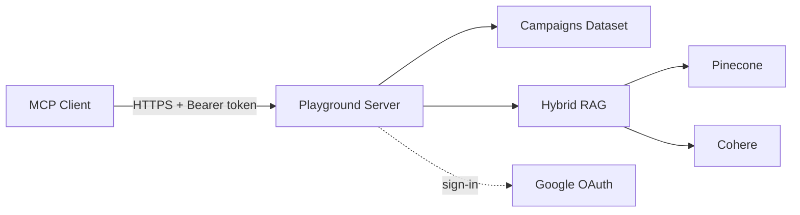
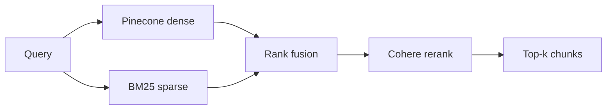

# MCP Playground

A public MCP server you can point your agent at in under a minute — the one
behind [mcpbuilders.dev](https://mcpbuilders.dev). It's a live demo of two
things I kept getting asked about: **per-user OAuth on an MCP server**, and a
**hybrid-RAG pipeline** you can actually query.

The deployed server is authenticated with Google Authentication — every call needs a Google
sign-in. Add the server, your MCP client will pop the Google consent screen
on first use, and after that every tool call is scoped to *you*.

## Quickstart

```bash
$ claude mcp add --transport http playground https://playground.mcpbuilders.dev/mcp

$ hermes mcp add playground --url https://playground.mcpbuilders.dev/mcp --auth oauth
```

The first tool call triggers a browser tab to sign in with Google. Approve
it once, then try:

- *"What are the top creatives by ROAS this month?"* — campaigns dataset.
- *"Search the Sherlock Holmes stories for a scene with a bicycle."* — hybrid RAG over public-domain text.
- *"Which stories take place in Utah?"* - another example of hybrid RAG

Same server, one sign-in, everything scoped to your identity. That's the
goal.

## Why this exists

Most MCP examples show one of two things: an anonymous read-only server, or
a fully-locked-down internal one. What people actually want to ship is
somewhere in between — real product tools, backed by a real identity. This
repo is an end-to-end example: Google
OAuth on an MCP server, saved state scoped to the caller, deployed on
Cloud Run.

The RAG demo is here because "hybrid retrieval" gets talked about a lot but
rarely shown as a runnable feature. Point your agent at it and ask questions
of *The Adventures of Sherlock Holmes*, *A Study in Scarlet*, or *The Hound
of the Baskervilles* — a Pinecone-dense + BM25-sparse + Reciprocal Rank
Fusion + Cohere rerank pipeline over public-domain text.

Two demos, one server, both live.

## What's in it



| Tool | What it does |
|---|---|
| `top_creatives` | Creatives ranked by ROAS over 7d/30d/90d |
| `spend_breakdown` | Spend/revenue by channel, campaign, or creative type |
| `list_campaigns` | All campaigns with creatives and 90d totals |
| `rag_query` | Hybrid retrieval over the Gutenberg corpus |
| `list_documents` | Corpus manifest — titles, authors, source URLs |
| `get_document` | Full text of one book by id |

Every tool requires a valid Google token in production. Local dev can flip
this — see below.

<details>
<summary>Hybrid RAG pipeline</summary>



- **Offline** (`playground-rag-build`): chunk the corpus, embed to Pinecone,
  write `bm25_index.json` next to the corpus. The BM25 file is committed so
  the deployed image serves queries without needing API keys at build time.
- **Runtime**: query hits both retrievers in parallel, results fuse, Cohere
  reranks, top *k* chunks come back with `{doc_id, title, author, source_url}`.

Read more about [Retrieval-Augmented Generation](https://www.pinecone.io/learn/retrieval-augmented-generation/)
and [building a RAG agent with hybrid search](https://developer.nvidia.com/blog/build-a-rag-agent-with-nvidia-nemotron/).

</details>

<details>
<summary>Storage</summary>

| Store | Backend | Lifetime |
|---|---|---|
| Campaigns dataset | in-memory | process |
| Saved views | in-memory dict | process |
| OAuth registrations / tokens | in-memory | process |
| Corpus + BM25 index | on-disk (in image) | image |
| Dense vectors | Pinecone (remote) | account |

Restart = clients re-register and re-authenticate, saved views forgotten.
Acceptable for a playground.

</details>

## How auth works

<details>
<summary>The 30-second version</summary>

OAuth is handled entirely by FastMCP's stock
[`GoogleProvider`](https://gofastmcp.com/servers/auth/oauth-proxy) against a
Google OAuth web client. It's an OAuth proxy that implements the MCP
authorization spec — discovery, dynamic client registration, PKCE, the whole
callback dance. No custom auth server code lives in this repo. Users sign in
on Google's own consent screen.

The server is mounted as `FastMCP(auth=provider)`, so every request must
carry a Bearer token. MCP clients like Claude Desktop/Code see the `401 +
WWW-Authenticate` on their first call and automatically start the OAuth
dance — the user only sees "sign in with Google" pop up in the browser.

Read more about [OAuth in FastMCP](https://gofastmcp.com/clients/auth/oauth).

</details>

<details>
<summary>The <code>AUTH_MODE</code> switch</summary>

Set in [server.py](src/playground/server.py). Two settings:

- **`required`** — every request needs a valid
 Google token. Claude Desktop/Code auto-trigger the sign-in flow on first
  connect.
- **`off`** — no auth wiring at all.

</details>

## Run it locally

```bash
uv sync
cp .env.example .env   # fill in the OAuth client, or set AUTH_MODE=off
uv run playground      # http://localhost:8080/mcp
```

Point Claude Code at it:

```bash
claude mcp add --transport http playground-local http://localhost:8080/mcp
```

Or open the MCP Inspector: `npx @modelcontextprotocol/inspector`.

<details>
<summary>Setting up your own Google OAuth client</summary>

In any GCP project of your own:

1. GCP Console → APIs & Services → Credentials → **Create Credentials → OAuth
   client ID → Web application**.
2. Add authorized redirect URIs:
   - `http://localhost:8080/auth/callback` (local dev)
   - Your production `/auth/callback` URL if you deploy this.
3. Put the client ID + secret in `.env` (copy from `.env.example`).

If you'd rather skip OAuth entirely for local development, set `AUTH_MODE=off`
and every tool becomes callable without a token.

</details>

<details>
<summary>Turning on the RAG tools</summary>

They need `GOOGLE_API_KEY` (Gemini embeddings), `COHERE_API_KEY` (reranker),
and `PINECONE_API_KEY` (dense index) in `.env`. Optional overrides:
`PINECONE_INDEX` / `PINECONE_CLOUD` / `PINECONE_REGION` (defaults
`playground-rag` / `aws` / `us-east-1`).

Missing keys don't crash the server — the RAG tools just return a clear error
at call time. Build the index once:

```bash
uv run playground-rag-build   # embeds the corpus to Pinecone, writes bm25_index.json
```

`bm25_index.json` is the persisted sparse-retrieval side. It's checked into
the repo so the deployed image serves queries without needing API keys at
build time. Rebuild it after any corpus change.

Corpus lives in [`src/playground/data/corpus/`](src/playground/data/corpus/).
Add any Project Gutenberg book:

```bash
curl -sSL -o src/playground/data/corpus/<slug>.txt \
  https://www.gutenberg.org/cache/epub/<id>/pg<id>.txt
# then add the entry to manifest.json and re-run playground-rag-build
```

</details>

## Tests

```bash
uv run pytest
```

`tests/test_auth_flow.py` boots the real ASGI app and walks the whole flow —
discovery, dynamic client registration, the unauthenticated 401, and the
authenticated path (with a stubbed token verifier, so no live Google
needed).

The campaigns dataset is generated by `python -m playground.data.generate`.

## Deploy

Any container host works — the app is a plain ASGI server behind the
[Dockerfile](Dockerfile). At a minimum, whatever runs it needs:

- `BASE_URL` — the public HTTPS URL of your deployment.
- `GOOGLE_OAUTH_CLIENT_ID` / `GOOGLE_OAUTH_CLIENT_SECRET` — a Google OAuth
  web client whose authorized redirect URI is `{BASE_URL}/auth/callback`.
- `AUTH_MODE=required` (the default).
- Optional RAG keys if you want the retrieval tools live.

Cloud Run example:

```bash
gcloud run deploy mcp-playground --source . \
  --region us-central1 --allow-unauthenticated \
  --min-instances 0 --max-instances 1 \
  --set-env-vars BASE_URL=https://your.domain,GOOGLE_OAUTH_CLIENT_ID=... \
  --set-secrets GOOGLE_OAUTH_CLIENT_SECRET=your-secret-name:latest
```

`--allow-unauthenticated` here means the platform accepts the request — the
MCP server then enforces its own Bearer-token check.

**`--max-instances 1` is load-bearing** for this repo as-is. OAuth client
registrations and saved views live in memory per instance, so a scale-out or
restart makes MCP clients re-register and re-authenticate (standard 401
semantics) and forgets saved views. Fine for a playground. To lift the cap,
back the OAuth provider with a persistent `client_storage` and move the
in-memory `VIEWS` dict to a real datastore.

## License

MIT — see [LICENSE](LICENSE). The corpus files under
`src/playground/data/corpus/` are public-domain Project Gutenberg texts (see
`manifest.json` for source URLs).