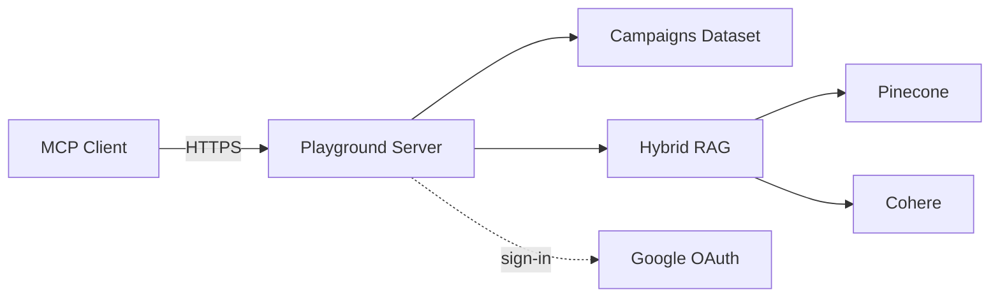
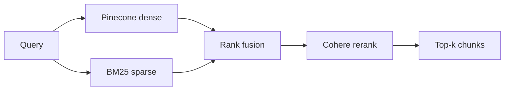

# Architecture

One FastMCP server behind Cloud Run. Two demos share the process: a read-only
campaigns dataset (with optional Google sign-in for saved views) and a hybrid
RAG demo over public-domain books.

## System

- **Anonymous** tools serve the campaigns dataset and the RAG queries.
- **Google sign-in** gates the per-user tools (`save_view`, `my_views`).
- Cloud Run runs a single instance; state (dataset, saved views, OAuth
  registrations) lives in memory.

## RAG

- **Offline** (`playground-rag-build`): chunk the corpus, embed to Pinecone,
  write `bm25_index.json` next to the corpus. The BM25 file is committed so
  the deployed image serves queries without needing API keys at build time.
- **Runtime**: query hits both retrievers in parallel, results fuse, Cohere
  reranks, top *k* chunks come back with `{doc_id, title, author, source_url}`.

## Storage

| Store | Backend | Lifetime |
|---|---|---|
| Campaigns dataset | in-memory | process |
| Saved views | in-memory dict | process |
| OAuth registrations / tokens | in-memory | process |
| Corpus + BM25 index | on-disk (in image) | image |
| Dense vectors | Pinecone (remote) | account |

Restart = clients re-register and re-authenticate, saved views forgotten.
Acceptable for a playground.