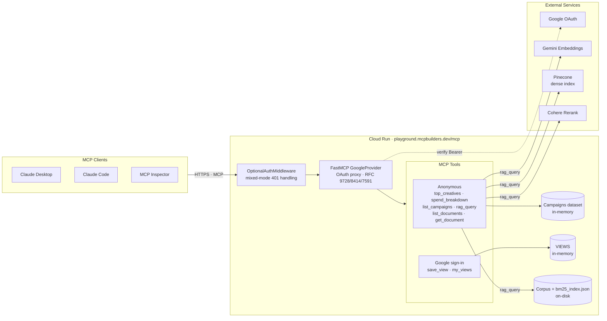
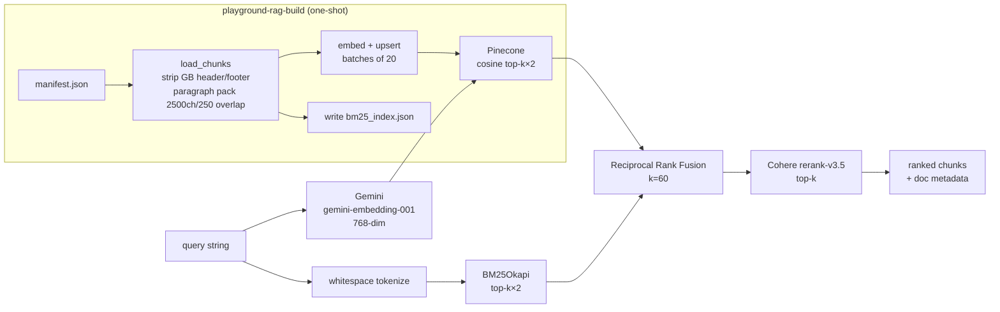

# Architecture

Two subsystems share one FastMCP process behind Cloud Run: a read-only
campaigns dataset (with optional per-user Google OAuth for saved views) and
a hybrid RAG demo over public-domain books.

## System view

### Auth flow (mixed mode)

- Anonymous request → `OptionalAuthMiddleware` lets it through → tool runs.
- Request with a valid Bearer token → `GoogleProvider` middleware verifies
  against Google, attaches identity → gated tool sees the caller.
- Request with an invalid/expired token → `401 + WWW-Authenticate` so the
  client auto-triggers the sign-in flow.
- Discovery / dynamic client registration / `/auth/callback` are all mounted
  by FastMCP's `GoogleProvider` — no custom auth server code lives here.

## RAG pipeline

### Runtime path (`rag_query`)

1. Embed the query with Gemini (`GoogleGenerativeAIEmbeddings`,
   768-dim to match the index).
2. In parallel-ish: Pinecone cosine similarity search for `k×2` dense hits;
   `BM25Okapi.get_scores()` over the in-memory tokenized corpus for `k×2`
   sparse hits.
3. Reciprocal Rank Fusion with `k=60` merges the two ranked lists into a
   unified candidate set (~2k candidates deduped).
4. Cohere `rerank-v3.5` scores candidates against the query; top `k` win.
5. Return chunks with `{doc_id, title, author, chunk_index, source_url}`.

### Offline path (`playground-rag-build`)

1. Read `manifest.json`, load each book's text, strip Project Gutenberg
   header/footer via regex.
2. Paragraph-aware greedy pack into ~2500-char chunks with 250-char tail
   overlap (`corpus.py:50`).
3. Embed and upsert to Pinecone in batches of 20 with 1.5s sleeps to stay
   under Gemini embedding RPM quotas; retry up to 6 times on transient errors.
4. Persist the tokenized corpus + metadata to `bm25_index.json` next to the
   corpus files. This file is checked into git so the Docker image serves
   queries without needing API keys at build time.

The build is **not incremental**: adding one book re-embeds the whole corpus.
Fine at four books, worth revisiting at forty.

## Storage summary

| Store | Backend | Lifetime | Notes |
|---|---|---|---|
| Campaigns dataset | in-memory | process | Generated by `playground.data.generate`; deterministic. |
| Saved views (`VIEWS`) | in-memory dict | process | Cleared on restart — playground semantics. |
| OAuth client registrations / tokens | in-memory (default) | process | Upgrade path: pass `client_storage=<AsyncKeyValue>` to `GoogleProvider`. |
| BM25 sparse index | JSON on disk | image | Rebuilt by `playground-rag-build`, checked into git. |
| Corpus text | plain `.txt` on disk | image | Public-domain Gutenberg files. |
| Dense vectors | Pinecone (remote) | account | Populated by `playground-rag-build`. |

`--max-instances 1` on Cloud Run is load-bearing because of the in-memory
stores. Restart == re-register + re-authenticate for clients, saved views
lost.